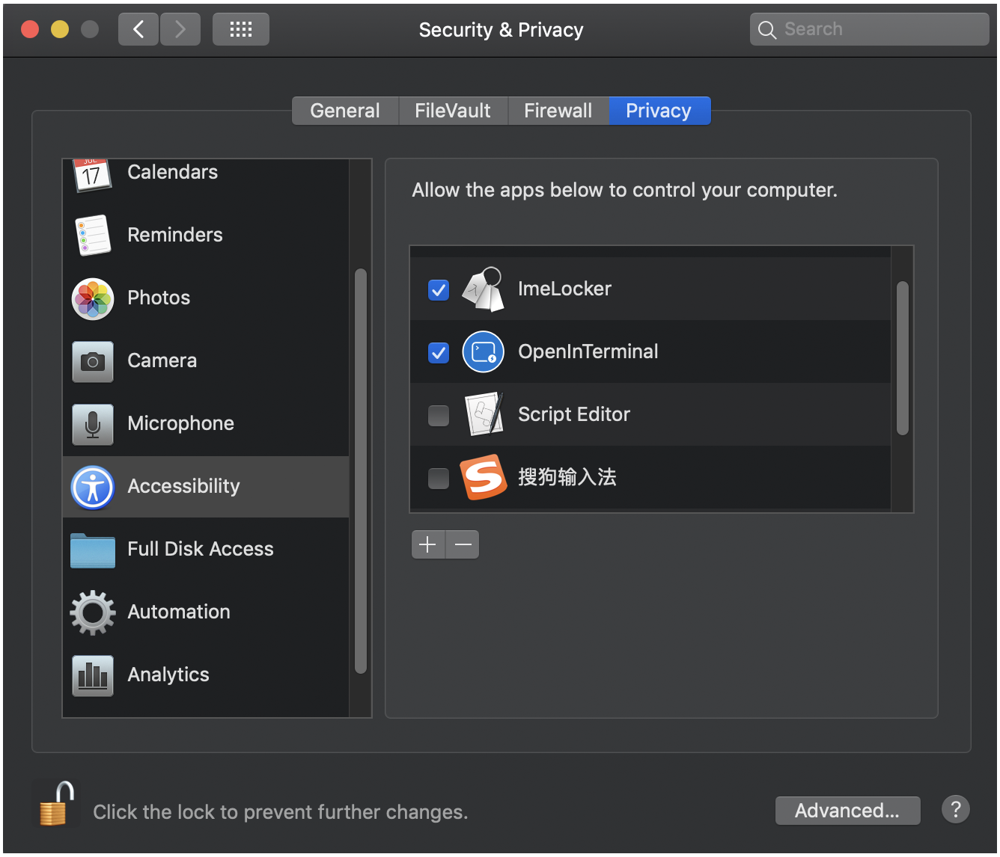

This application was modified from https://github.com/itsuhane/SwitchKey .

# ImeLocker

Automatically lock the input source.

Ever hassled by wrong input source when switching application?  
ImeLocker can automatically lock your choice for you.

### Download & Install (Manaual)

[Version 1.0.0](https://github.com/labolado/ImeLocker/releases/download/ImeLocker.zip) (macOS)  
Uncompress, then drag & drop into your Applications folder.

### Usage

- Lock current input source:  
  click "Lock Current".

- Lock/UnLock:  
  check/uncheck the checkbox on the right.

Not working? See below.

### First Run

Upon first launch, ImeLocker will ask for accessibility permission.  
ImeLocker will open accessibility page, **and exit**.  
After you grant permission, re-launch ImeLocker again.  
The same will happen if you reject the permission later.

### Purchase

I wrote this because I tried some other tools.  
They are either buggy or too cumbersome to configure.  
I payed money and time for them.  
So you don't have to pay for them anymore.

### Bug Report & Feature Request

Welcome! Please click [here](https://github.com/itsuhane/SwitchKey/issues/new).
